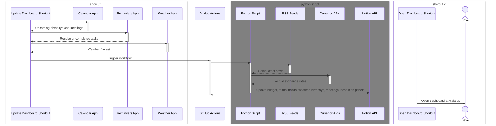

# Shortcuts

This repo is just about playing with Apple shortcuts. I've created a couple to update & open a so-called "daily dashboard" every
morning. Here's its high-level diagram 🧜‍ 

Here is a couple of others I found useful myself

* [Toggle VPN](/exports/toggle-vpn.shortcut) is used in pair with an extra focus mode (activated when some apps are
  opened) and an automation based on the focus mode. It toggles Tunnel Bear automatically when an app used with a VPN is
  opened or closed. It requires an additional [app](https://apps.apple.com/by/app/actions/id1586435171) for extra
  actions.
* [Block Doomscrolling](/exports/block-doomscrolling.shortcut) is technically used in a similar way as the previous. It
  exits an app when it is being use for longer than 3 minutes. Found it really useful in pair with Screen Time.
